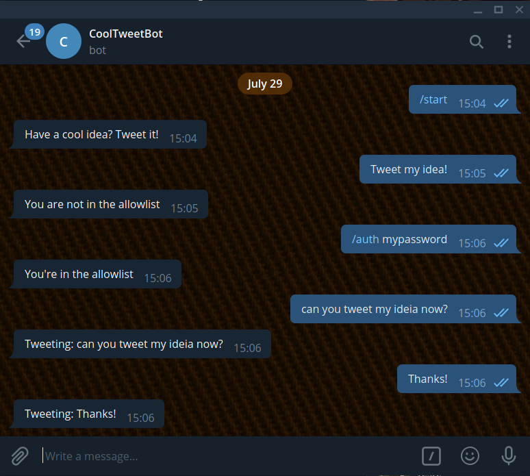
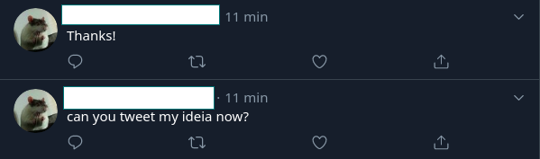

## Motivation
Have you ever been using Telegram, chatting with a friend, said a funny quote and thought: _"I should tweet it"_, but twitter app was too far?

**Your problems are over!**

With this bot, the only thing you need to do is share your message in the chat, and it will tweet it for you!

## Configuration

Before using it, you must make your twitter account a [developer account](https://developer.twitter.com/.

Then, you must create a src/conf/allowlist.csv, which will contain a list of telegram users that can tweet in your account (it's recommendend that you add just your user).

Finally, you must create a src/conf/.env file, with these lines:

```
TELEGRAM_TOKEN =
consumer_key = 
consumer_secret = 
access_token = 
access_token_secret = 
password = 
```

You can get a telegram token with @BotFather. The password is used to add usernames to the allowlist.

## Using It

/start - Welcome message

/auth __password__ - add your user to the allowlist

any other message will be tweeted in your account (also works with fowarded messages)


